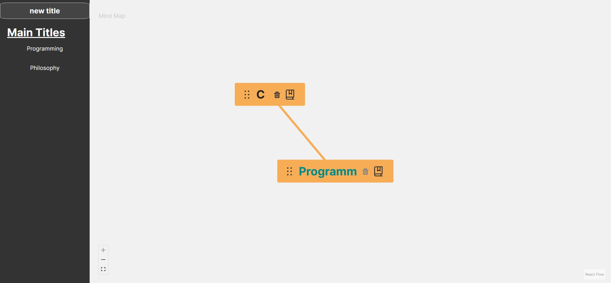

# Mind Notes Application


    I know the style is awfull :)

## Introducing "Mind Notes": Your Ultimate Mind Mapping and Markdown Fusion

"Mind Notes" stands at the crossroads of innovation, seamlessly integrating the power of mind mapping and markdown editing into a single, unified application. Crafted with precision using the dynamic Golang backend and the interactive React frontend, this groundbreaking application empowers users to visualize their ideas, thoughts, and projects in an intuitive and organized manner.

**Mind Mapping Redefined:**
With "Mind Notes", the art of brainstorming and idea organization reaches new heights. Its robust mind mapping functionality allows users to create intricate webs of interconnected concepts, effortlessly reflecting the complexity of their thoughts. The user-friendly interface provides a diverse range of customizable nodes and connectors, enabling users to express relationships between ideas with utmost clarity. Drag and drop functionality, auto-layout options, and various formatting tools ensure that users can bring their creative visions to life without constraints.

**Markdown Mastery:**
Harness the power of markdown with "Mind Notes." Seamlessly switch to the markdown editing mode and seamlessly transition from visualizing your thoughts to precisely articulating them. Whether it's writing project documentation, jotting down meeting minutes, or crafting a blog post, the markdown editor provides a distraction-free environment with real-time previews, ensuring that your content appears exactly as intended.

**Golang Backend – Stability and Performance:**
"Mind Notes" is powered by Golang, a programming language renowned for its efficiency, performance, and concurrency capabilities. This ensures that the application runs smoothly, even when handling intricate mind maps and markdown documents. The backend manages data synchronization, user authentication, and real-time collaboration, providing a seamless experience across devices.

**React Frontend – Interactivity at Your Fingertips:**
The frontend, developed using React, offers a highly responsive and interactive interface. Users can effortlessly navigate through their mind maps, customize node properties, and toggle between the mind mapping and markdown modes with a few clicks. The intuitive design prioritizes user experience, allowing both seasoned professionals and newcomers to seamlessly grasp the application's features.

**Perfect Harmony – Mind Maps and Markdown:**
What truly sets "Mind Notes" apart is its ability to harmoniously blend mind maps and markdown. Whether you're fleshing out ideas through visually captivating mind maps or refining your thoughts with structured markdown content, the application adapts to your workflow seamlessly. This integration transcends the limitations of traditional note-taking apps, enabling users to explore ideas in both a visual and textual manner.

In a world where ideas are the currency of progress, "Mind Notes" emerges as the ultimate tool for ideation, organization, and expression. With its Golang-backed stability, React-powered interactivity, and the groundbreaking fusion of mind mapping and markdown, this application redefines how we capture, nurture, and share our thoughts. Elevate your creative process with "Mind Notes" – where the fluidity of thoughts meets the structure of words, all in one transformative platform.

## running

### Docker

you can build this app using docker and run it

build:

```shell
docker build -t mind_notes .  
```

run:

```shell
docker run -p 3000:3000 -v ./data2:/dist/data mind_notes
```

using docker compose:

```shell
docker compose up
```

Now the app is available on `http://localhost:3000/`

---

### build from source

#### **pre requirements**

- golang 1.19 or above
- nodejs 18
- npm
- make

run the following commands to clone repository:

```shell
git clone https://github.com/tahaontech/mind_notes.git
```

then run these command step by step:

```shell
# change directory to project dir
cd mind_notes
# install frontend dependency and build UI folder
make install
# run the whole app
make run

```

Now the app is available on `http://localhost:3000/`

## development tips

1. build the UI folder after each frontend change before push:

```shell
make build-front
```

## Contribution Guidelines

Thank you for considering contributing to the "Mind Notes" repository! We welcome your contributions to help improve and enhance this innovative mind mapping and markdown editor application. Your efforts will play a vital role in making "Mind Notes" even more powerful and user-friendly.

To ensure a smooth collaboration process, please take a moment to read and understand the following guidelines.

### Getting Started

1. **Fork the Repository:** Start by forking the "Mind Notes" repository to your GitHub account. This will create a copy of the repository that you can freely work on.

2. **Set Up Development Environment:** Follow the instructions in the repository's README to set up the development environment, including installing dependencies and running the application.

### Making Contributions

1. **Create a Branch:** Before making changes, create a new branch with a descriptive name that reflects the nature of your contribution. For example:

   ```bash
   git checkout -b feature/new-feature
   ```

2. **Code Changes:** Make your desired changes to the codebase. Ensure that your code follows the project's coding conventions and style guidelines.

3. **Commit Changes:** Commit your changes with a clear and concise commit message. Include any relevant details about the changes you've made.

4. **Pull Request:** Push your changes to your forked repository and then create a pull request (PR) to the master repository's `master` branch. In your PR description, provide a clear explanation of your changes and their purpose.

### Contribution Tips

- Review the existing issues and pull requests to see if someone is already working on a similar contribution. Collaboration is key!

- If you're adding a new feature or making a significant change, consider opening an issue first to discuss the proposal with the maintainers and the community.

- Ensure your code is well-documented and includes comments where necessary to enhance its readability and maintainability.

- Write unit tests for your code whenever possible to ensure its correctness and prevent regressions.

### Code of Conduct

All contributors are expected to adhere to the project's [Code of Conduct](CODE_OF_CONDUCT.md). Please maintain a respectful and inclusive environment throughout the development process.

### Feedback and Support

If you have any questions, encounter issues, or need assistance, feel free to open an issue in the repository. The community and maintainers are here to help you out.

Thank you for your interest in contributing to "Mind Notes." Your dedication and expertise contribute to the growth and success of the project. Happy coding!
